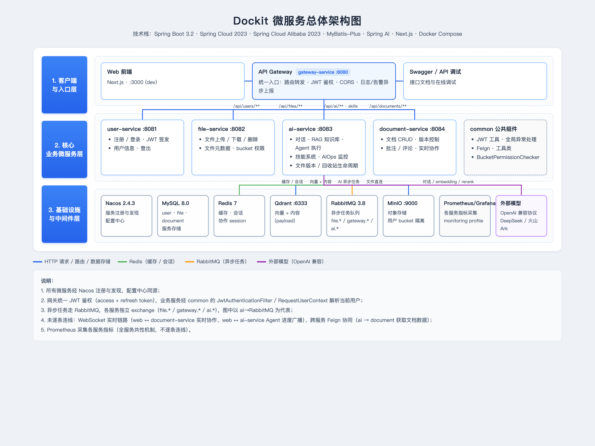

# Dockit 架构总览

> 2026-08 更新。当前为微服务架构（Spring Cloud Alibaba + Next.js），领域词汇见根目录 `CONTEXT.md`。
> 技术栈：Spring Boot 3.2 · Spring Cloud 2023 · Spring Cloud Alibaba 2023.0.1 · MyBatis-Plus · Next.js (Bootstrap 5) · Docker Compose

## 服务拓扑

> 图例：蓝实线 = HTTP 请求 / 路由 / 数据存储 · 绿实线 = Redis（缓存/会话） · 橙实线 = RabbitMQ（异步任务） · 紫实线 = 外部模型（OpenAI 兼容）。
>
> **说明**：
> 1. 所有微服务经 Nacos 注册与发现，配置中心同源；
> 2. 网关统一 JWT 鉴权（access + refresh token），业务服务经 common 的 `JwtAuthenticationFilter` / `RequestUserContext` 解析当前用户；
> 3. 异步任务走 RabbitMQ，各服务独立 exchange（`file.*` / `gateway.*` / `ai.*`），图中以 ai→RabbitMQ 为代表；
> 4. 未逐条连线：WebSocket 实时链路（web ↔ document-service 实时协作、web ↔ ai-service Agent 进度广播）、跨服务 Feign 协同（ai → document 获取文档数据）；
> 5. Prometheus 采集各服务指标（全服务共性机制，不逐条连线）。
>
> 可交互版本（SVG 矢量、响应式连线）见 `docs/architecture.html`。

> 图例：━━ 蓝实线 = HTTP 请求 / 路由 / 数据存储 · ━━ 绿实线 = Redis（缓存/会话） · ━━ 橙实线 = RabbitMQ（异步任务） · ━━ 紫实线 = 外部模型 · ┅┅ 灰虚线 = 业务协同 / WebSocket。
>
> **说明**：所有微服务经 Nacos 注册与发现、指标采集 Prometheus（全服务共性机制，不逐条连线，见节点描述）；异步任务按 `file.*` / `gateway.*` / `ai.*` 各服务独立 exchange 收发（图中仅画 ai 代表性一条）。

**说明**：
1. 所有微服务通过 Nacos 注册与发现，配置中心同源；
2. 网关统一鉴权（JWT），业务服务经 common 的 `JwtAuthenticationFilter` / `RequestUserContext` 解析当前用户；
3. 文档版本控制：原始文件按 `document-files/{docId}/v{n}/` 存 MinIO，元数据存 `document_version` 表（早期 git 仓库存储与 DocParserClient 合同对比/版本 diff 均已移除，版本逻辑现并入 `DocumentServiceImpl`）；
4. 异步任务（文件操作、AI 请求等）走各服务独立 RabbitMQ exchange（`file.*`、`gateway.*`、`ai.*`）。

## 服务清单

| 服务 | 端口 | 职责要点 | 存储 |
|---|---|---|---|
| gateway-service | 8080 | JWT 认证过滤、路由、CORS、日志/告警异步上报 | Redis(会话?) |
| user-service | 8081 | 注册、登录、refresh token | MySQL `user` |
| file-service | 8082 | 文件上传/下载/删除/查询，bucket 权限校验，MQ 任务消费 | MySQL `file_metadata` + MinIO |
| ai-service | 8083 | 对话、RAG 知识库、Agent 执行（计划/工具/审批/反思）、技能系统（SkillRegistry）、统一 OpenAI 兼容模型接入、异步 AI 任务消费、AIOps 监控、文件版本/回收站生命周期状态（见 ADR-0001） | Redis + Qdrant(向量+内容) + MySQL(经 document?) + MinIO 直连 |
| document-service | 8084 | 文档 CRUD、版本控制、批注/评论、实时协作（WebSocket） | MySQL `document*` + MinIO |
| web/ | 3000 | Next.js 前端：工作台、文档编辑、Agent 页 | — |

## 关键机制

1. **认证链路**：web → gateway 的 `AuthGlobalFilter` 校验 JWT → 透传用户身份；各服务经 common 的 `JwtAuthenticationFilter` / `RequestUserContext` 解析当前用户。登录后签发 access + refresh token。
2. **文件权限模型**：每个用户有独立 **bucket**（MinIO 隔离），校验逻辑单一实现于 common 的 `BucketPermissionChecker`（纯逻辑，无用户上下文依赖），file/ai/document 各留一个薄适配器注入自己的用户上下文（SecurityContextHolder / RequestUserContext），防越权访问他人文件。
3. **异步任务**：文件上传/下载/删除、AI 模型请求等耗时操作走 RabbitMQ 任务队列（各服务独立 exchange：`file.*`、`gateway.*`、`ai.*`），生产者/消费者解耦。
4. **RAG 链路**：document → 切分（定长/语义/章节策略）→ 向量化 → Qdrant（向量 + 原文内容/元数据同存 payload，命中即取）→ 检索 + rerank → 回答。检索与问答链统一收口在 ai-service 的 `KnowledgeQueryService`（`search` 纯检索 / `ask` 问答），RagController `/query` 与 Agent Tool（rag-answer / rag-search）共用，不再各自拼装；`apiModelName` 适配层把内部模型名映射到各厂商实际模型名。检索链路埋点（`rag.embedding`/`rag.vector-search`/`rag.rerank`/`rag.search`）接入 AIOps 监控。
5. **Agent 执行**：目标 → 计划（多步）→ 每步调 Agent Tool → 高风险步骤人工审批 → 执行完反思（Reflection）→ WebSocket 广播进度。**Agent Tool 是模块**：schema（`AgentToolDefinition`）与执行（`execute`）同处一个实现类（`agent.execution.tool.*`，18 个工具），`AgentToolRegistry` 只做组装与门面；执行器（`AgentExecutionService`）只保留编排（规划/占位符解析 `PlaceholderResolver`/兜底规划 `FallbackPlanner`/清洗 `GeneratedContentSanitizer` 已外化为内部模块）。任务快照与审批 token 存 Redis（`agent:task:*`，7 天 TTL，token 有 O(1) 索引），会话上下文 `ctx:*` 与对话 `conv:*` 共享同一 TTL 生命周期（`ai.conversation.expiry-hours`）。
6. **实时协作**：document-service 维护 `CollaborateSession`，编辑操作带光标位置经 WebSocket 广播，快照由 `DocumentSnapshotService` 管理。
7. **文档版本**：版本原始文件按 `document-files/{docId}/v{n}/` 存入 MinIO，元数据（fileUrl/版本号/备注）存 `document_version` 表，支持任意版本读取与恢复。
8. **AIOps**：ai-service 内置 FaultDetector/MonitoringService/AlertService，对模型调用耗时等指标做故障检测与告警。
9. **AI 模型接入**：所有模型统一走 **OpenAI 兼容协议**（`provider/AIServiceProvider` + `OpenAICompatProvider`，原 DashScope/Volcano 专用实现已删除）。**模型清单完全配置驱动**：`application.yml` 的 `spring.ai.models.list`（`MultiModelConfig` 读取）是唯一事实源，每条声明 provider / name（显示名）/ 端点 / `apiModelName`，`AIServiceFactory` 启动时按配置逐条注册，**加模型或改显示名只改配置、不碰代码**（无模型枚举，原 `ModelType` 已删除）；`apiModelName` 适配层把内部模型名映射到各厂商端点实际模型名（同一条目见机制 4）。当前注册 3 个（deepseek-v4-pro / deepseek-v4-flash-vision-exp / ark-code-latest，`application-local.yml` 同）。耗时 AI 请求经 `async/` 包（`AsyncAIJobListener`/`AsyncAIJobService`）异步消费 RabbitMQ `ai.*` 队列。
10. **技能系统**：`skills/` 包以 `Skill` 接口 + `SkillRegistry`（注册） + `SkillExecutorService`（执行）组织，现有 FileDownload / FileUpload / HtmlPpt 三个技能（旧的 `SkillExecutor` 已删除）。
11. **架构决策**：跨服务所有权等决策记录在 `docs/adr/`（如 ADR-0001：File 版本/回收站生命周期状态归 ai-service 拥有）。

## 数据库说明

- `dockit` 库：核心 3 表 `user` / `document` / `file_metadata` 由 `mysql-schema.sql` 初始化；`document_version`、`document_access`、`document_annotation`、`document_comment` 等由 document-service 启动时经 `DocumentSchemaInitializer` 自动创建。
- `nacos_config` 库：Nacos 配置存储（schema 文件内建表）。

## 部署

- 一键：`./start.sh`（编译 → 构建 5 个镜像 → `docker compose up`）
- 根 `docker-compose.yml` 为主入口（`start.sh` 一键编译 → 构建 5 个镜像 → `docker compose up`）；另有拆分式 compose（`docker-compose-infra.yml` / `docker-compose-services.yml` / `docker-compose-gate-user.yml` / `docker-compose-monitoring.yml`）支持分层单独部署

## 本地测试

- 先加载环境变量再跑测试：`set -a; source .env; set +a`
- 宿主机直跑（容器外）时，MySQL 映射端口为 3307（非 3306），需覆盖：`MYSQL_HOST=localhost MYSQL_PORT=3307 REDIS_HOST=localhost RABBITMQ_HOST=localhost ./mvnw test`；RabbitMQ 未运行时其监听器告警可忽略
- 冒烟测试（`*ApplicationTests`）要求测试类与 `@SpringBootApplication` 主类同包
